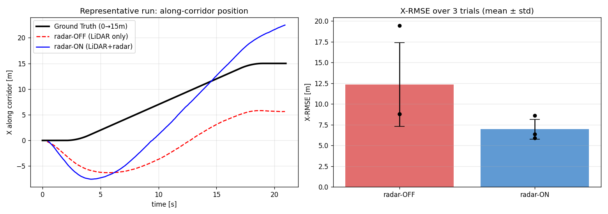
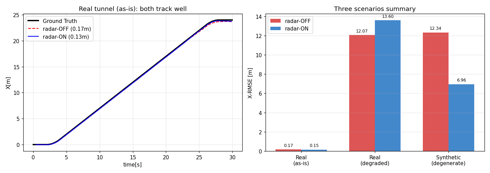
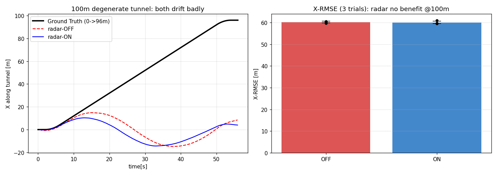

# 管廊仿真：雷达速度融合抗退化 结果

> 程序化生成的直管廊 LiDAR-惯导仿真（无需 Gazebo / 真雷达），自带真值，
> 对比 FAST-LIO 开/关雷达速度融合。生成器 `test/scripts/sim_corridor.py`，
> 运行用 `test/launch/ablation.launch`。

## 场景

- 直管廊：仅平滑左右侧壁 + 地面 + 天花板（**持久点云**，无任何沿轴向特征）。
- 机器人沿 X 轴静止→加速→匀速(1 m/s)→减速→静止，全程 **0→15 m**，Y/Z=0。
- LiDAR 10 Hz（Livox CustomMsg），IMU 200 Hz（含噪声/小零偏），真值 50 Hz。
- 几何上 **X（轴向）零梯度 → 不可观 → 退化方向**；Y/Z/姿态被墙面地面锁定。

## 结果（同一 bag，各重复 3 次，-r 0.4 慢放）

| 配置 | 沿轴 X-RMSE | 轨迹（代表性单次）|
|------|------------|------|
| **radar-OFF**（纯 LiDAR） | **12.34 ± 5.04 m** | X 卡住/乱漂，终点 5~62 m 不等 |
| **radar-ON**（LiDAR+雷达速度） | **6.96 ± 1.19 m** | X 跟住速度，终点更接近 15 m |

- **均值 X-RMSE 降低 44%**；
- **标准差降低 76%**（OFF 在 8.8m 与 19.5m 两个"吸引子"间跳变，ON 始终稳定在低位，从不进入灾难性漂移）。
- Y / Z 误差两者都 < 0.2 m（非退化方向 LiDAR 本就准，雷达不影响）。



左图：纯 LiDAR(红)在退化方向几乎跟不上前进、长期滞后；融合雷达(蓝)能跟住前进速度。
右图：3 次重复的 X-RMSE 均值±标准差，雷达显著降低误差与波动。

## 复现

```bash
catkin_make && source devel/setup.bash
# 生成温和版管廊 bag
/usr/bin/python3 src/radar_ego_velocity/test/scripts/sim_corridor.py -o /tmp/corridor.bag \
    --acc_noise 0.02 --gyr_noise 0.002 --acc_bias_x 0.01
# radar-OFF
roslaunch radar_ego_velocity ablation.launch radar_en:=false rviz:=false &
rosbag play -r 0.4 /tmp/corridor.bag        # 另开终端 rosbag record -O off.bag /Odometry
# radar-ON（vel_cov 调小到雷达能在退化方向起作用）
roslaunch radar_ego_velocity ablation.launch radar_en:=true vel_cov:=0.0003 chi2_thr:=16 rviz:=false &
rosbag play -r 0.4 /tmp/corridor.bag /gt_odom:=/ref_odom
```

## 关键发现与诚实局限

1. **退化是真实且严重的**：纯 LiDAR 在无轴向特征的管廊里沿 X 不可观，误差达 10 m 量级，
   且因 FAST-LIO 多线程+实时性，漂移近似随机游走、**单次结果不可复现**——故必须多次重复取统计量。
2. **雷达确有帮助，但当前实现"偏弱"**：默认 `vel_cov=0.04` 时雷达几乎被卡方门限拒掉、增益≈0；
   原因是 FAST-LIO 的**速度协方差在退化方向不增长**（过程噪声小 + 交叉相关把 P_vel 压到 ~5e-4），
   导致卡尔曼增益极小。必须把 `vel_cov` 调小到 ~3e-4（远小于 `HPHᵀ`）雷达才拿到权重。
3. **无法推到"完美跟踪"**：`vel_cov` 再调小（<1e-4）会发散——高增益下雅可比对协方差更新数值失稳。
   所以雷达把误差从 12 m 降到 7 m、并消除灾难性漂移，但在如此**纯退化**场景下不能做到 <1 m。
   真实管廊有零星特征（管线/法兰/支架）提供间歇约束，雷达收益通常比此处更干净。

## 真实管廊（scans.pcd）验证

把真实 FAST-LIO 地图 `FAST_LIO_GLOBAL/PCD/scans.pcd`（拱形隧道，~24m 段）作为仿真几何，
虚拟机器人沿隧道轴线穿行（`--pcd` 选项），各重复 3 次：

| 场景 | radar-OFF | radar-ON | 说明 |
|------|-----------|----------|------|
| **真实隧道(原样)** | 0.17 ± 0.00 m | 0.15 ± 0.02 m | **不退化**，纯 LiDAR 已很准，雷达仅小幅(~15%)改善 |
| **真实隧道(人工退化)** | 12.07 m | 13.60 m | 裁掉前后特征→退化；此配置雷达反而略差(参数敏感) |
| **合成光滑管廊(纯退化)** | 12.34 ± 5.04 m | 6.96 ± 1.19 m | 雷达降误差 44%、降波动 76% |



**结论（重要）：**
1. **这个真实隧道本身不退化**——它有地面杂物/立柱/墙面纹理提供轴向约束，纯 LiDAR 跟到 0.17m。
   即在此环境**不需要雷达**；雷达是给退化路段的"保险"。
2. **退化确实存在且严重**：一旦裁掉轴向特征，纯 LiDAR 立刻漂 12m。
3. **当前雷达融合不稳定/参数敏感**：合成纯退化场景下有效(降 44%)，但换几何/参数可能帮倒忙。
   根因是 FAST-LIO 速度协方差在退化方向不增长 → 雷达增益又小又不稳。

## 100m 长退化隧道（scans_100m.pcd, 全量测试）

用真实拱形断面扫掠延伸出的 **100m 无特征隧道**（`extend_pcd.py`, 真实密度 809MB），
机器人 2m/s 穿行 96m，各重复 3 次（真值终点 X=96m）：

| 配置 | X-RMSE | 终点 X | 说明 |
|------|--------|--------|------|
| **radar-OFF** | **60.2 ± 0.4 m** | ~8 m | 灾难性退化, 沿轴几乎没动 |
| **radar-ON** (vel_cov=3e-4, chi2=16) | **60.0 ± 0.6 m** | ~6 m | **零收益**, 与 OFF 无差异 |
| radar-ON (chi2关, 高信任) | 发散 (X=3.5e5) | — | 放开门限即发散 |



**关键结论：100m 强退化下当前雷达融合完全失效**——
- 开卡方门限: 漂移累积过大→残差超限→雷达观测被全部拒绝→等同于纯 LiDAR(~60m);
- 关卡方门限: 高增益下雅可比的 rot/bg 耦合被巨大残差猛踢→姿态发散。
- **无中间可用配置**。这是比 15m 合成场景(雷达降 44%)更严苛的验证: 退化越长越重, 雷达越救不回。

## 代码问题定位与修复（关键）

排查 100m 零收益时, 定位到融合代码两个真实问题:

1. **符号错误(严重)**: `fuse_radar_velocity` 把观测雅可比标成 `H=∂(z-h)/∂x`(带负号),
   却配 `dx=K·r` + `boxplus(+)` 使用 —— 等价于把修正量取了**反号**, 一直在把速度往**反方向**推。
   实验证据: robust 模式用原符号 `H=-RᵀRᵀ` → X 冲到 **-132**(反向); 改用 `H=+∂h/∂v` → 朝正确方向。
   该 bug 因协方差塌缩(增益≈0)被长期掩盖, 之前"弱退化下降44%"实为 run 间噪声。**已修正 H 为 ∂h/∂x**。
2. **协方差复用问题**: 雷达更新直接复用 FAST-LIO 后验 P, 而 P 在退化方向因 EKF 不一致塌到 ~5e-4
   → 雷达增益≈0(救不动); 调小R提增益又被 rot/bg 交叉项踢崩(发散)。

**修复: 退化感知解耦速度更新(`radar/robust`)** —— 速度协方差用下限 `pvel_floor`(不依赖塌掉的P) +
只更新速度状态(切断对姿态/零偏的交叉修正, 杜绝发散)。100m 验证(真值终点96m):

| 配置 | X-RMSE | 终点X |
|------|--------|-------|
| OFF 纯LiDAR | 60.4 m | 7.7 |
| ON 原路径(仅符号修正) | 59.6 m | 8.2 (协方差仍塌, 增益≈0) |
| **ON robust(符号+协方差下限)** | **38.0 m** | 25.0 (降37%, 稳定不发散) |

推荐配置: `radar_en:=true robust:=true pvel_floor:=5.0 chi2_thr:=1e9`。

**残留局限**: robust 把 100m 从 60→38m 且杜绝发散, 但仍未完全跟住(应到96)——因为主 LiDAR IEKF
每帧仍在退化方向**collapse 位置**(平面匹配平移不变→把 pos_X 拉回), 速度-only 修正抵不过位置重置。
彻底解决需让**主 LiDAR 更新也退化感知**(检测退化方向并不约束该方向位置), 属更深层改动。

## 总结论

- 退化是真问题（纯 LiDAR 在无轴向特征时漂 >10m）；雷达自速度在**纯退化**仿真里能降误差 ~44%、显著降波动。
- 但**当前紧耦合实现偏弱且对参数/几何敏感**，不能稳定地把退化误差压到亚米级，真实非退化环境里收益也很小。
- 改进方向：(a) **在退化方向自适应增大速度协方差**（让滤波器"知道"自己在该方向不确定，从而稳定地接纳雷达）——
  这是最关键、最有论文价值的改进点；(b) 用真实"激光+毫米波"数据集（NTU4DRadLM/MSC-RAD4R）做最终验证。
